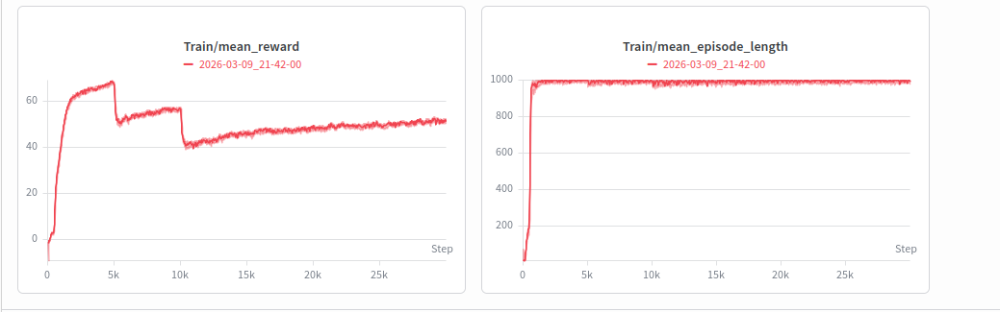
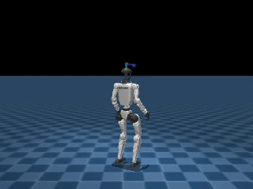
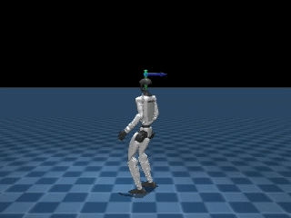
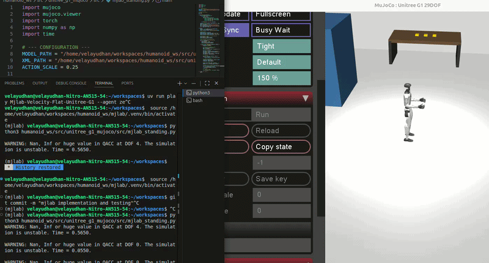

# **unitree_g1_mujoco repository** -  Physics related simulation of the robot
This repository deals with the Physics related simulation of the robot(Unitree G1) with the use of Physics engine MuJoCo.

MuJoCo being a physics engine with python dependency creating of python virtual environment is vital

# Virtual Environment - creation and configuration and commands used

#Navigate to your workspace 
*cd ~/xyz/workspace* 

#Create the virtual environment 
*python3 -m venv venv_mujoco* 

#Activate the environment 
*source venv_mujoco/bin/activate* 

#Install required packages 
*pip install --upgrade pip* 
*pip install mujoco numpy* 

# Visualization of the robot in Mujoco (Physics Engine) 

Python file that uses the native MuJoCo viewer enables to inspect the robot's geometry, joint axes, and frames.

*python3 ~/path_to_python_file/visualize_g1.py*

# Standing and Balancing 

The free-fall of the robot due to the influence of gravity. Implementation of PD controller would make the robot stand and balance itself. 

*python3 ~/path_to_script/stand_g1.py*

The reponses observed included with tuning factors are :   

a. The robot snapped to an upright position and "shiver" slightly. 

b. Immediate falling over immediately - increase KP to stabilise. 

c. High vibration violently or explodes - decrease KP or increase KD. 

Quick Insight - The robot stance is like a statue and no active compensation is considered at this point. The robot is like a statue and a slight push or pull may result in unstabilty and collapse. Fine tuning of the parameters can be further done however it seems to be irrelavant as reinforcement learning should be applied in the further stages

# Reinforcement Learning for Robot Self Balancing and Standing

## FOR LOCAL ENVIRONMENT RUN, EXECUTION AND TESTING - THIS FAILS FOR SURE DUE TO THE COMPLEXITY (FAILED FOR ME)

Reinforcement Learning (RL) environment using MuJoCo and Gymnasium to train a Unitree G1 humanoid robot to maintain a stable, upright standing posture. It utilizes the Stable Baselines3 PPO (Proximal Policy Optimization) algorithm for the training process.

Custom Gymnasium Environment: Wraps the MuJoCo physics engine to handle the G1's 29 degrees of freedom (DoF).

Reward Shaping: Features an advanced reward function designed to minimize jitter and "drunk" swaying by:

    Rewarding height maintenance and torso uprightness.

    Penalizing XY horizontal velocity (to stop drifting).

    Implementing Action Smoothing to prevent high-frequency oscillations.

    Penalizing excessive energy consumption and joint velocity.

Robust Reset: Each episode starts with randomized joint noise, forcing the model to learn recovery from different tilts and stances.

Training Pipeline: Uses PPO with automated checkpointing and TensorBoard logging for performance monitoring.

| Feature | Details |
| :----: | :----: |
|Action Space|meshes, 29 Continuous Torques (Box)|
|Observation Space|69 Dimensions (Joint positions & velocities)|
|Physics Engine|MuJoCo|
|RL Algorithm|PPO (MlpPolicy)|

To start training, ensure you have your URDF/XML path configured and run:

*python3 path_to_the_script/train_g1_balance.py*

Monitor progress via TensorBoard(in another terminal):

*tensorboard --logdir ./logs/g1_tensorboard/*   and browse *localhost:6006* in any browser for the progress

For the intermediate visualization of the trained models during the training

*python3 path_to_the_script/training_visualization_g1.py*

For testing the efficency of the trained model

*python3 path_to_the_script/test_g1_balance.py*

The intermediate checkpoint models and g1_self_balance_final.zip(final model with training done with 500000 steps) can be found in the unitree_g1_description/model_gym_PPO. However after verification through the testing script the generated model DID NOT SUFFICE the objective of the training and often made the robot follow weird patterns to balace itself.

## TRAINING WITH HIGH VERSALITY AND CONDITIONS WITH MUJOCOLAB(MJLAB)

For the training the google colab was utilised with the A100 GPU. Notebook can be found at unitree_g1_mujoco/mjlab_training_v2.ipynb

The respective models can be found at unitree_g1_description/mjlab_training_model_unitree_g1_phase1

Locomotion Training Phase: Flat Terrain Velocity Control

This phase establishes the foundational locomotion capabilities of the Unitree G1 humanoid robot on a standard flat surface. The primary goal is to achieve precise tracking of dynamic velocity commands while maintaining high stability.
Training Environment

    Environment ID: Mjlab-Velocity-Flat-Unitree-G1.

    Terrain Type: Perfectly flat, non-varying simulation environment.

    Simulation Scale: 2,048 parallel environments were utilized to generate high-throughput data for efficient policy learning.

Core Learning Objectives

The agent was trained to optimize a specific set of behaviors through a multi-objective reward structure:

    Omnidirectional Movement: Precise tracking of target linear velocities (x and y axes) and angular velocity (yaw).

    Postural Integrity: Strong emphasis on maintaining an upright posture and adhering to a stable reference pose to prevent falls and unnatural joint configurations.

    Locomotion Quality: Rewards for air_time and soft_landing were integrated to encourage a rhythmic gait and reduce high-impact forces on the simulated hardware.

    Efficiency: Penalties for excessive action_rate_l2 and joint_torque to ensure the resulting movements are energy-efficient and smooth.

Key Performance Milestones

The training successfully transitioned the agent from basic balance to robust velocity tracking:

    Maximum Stability: Reached a mean episode length of 1,000 steps (the maximum allowed), demonstrating that the policy is extremely stable on flat surfaces.

    Consolidated Reward: Achieved a high mean reward per episode, reflecting a strong mastery of tracking target commands without sacrificing posture.

    Efficiency Milestone: Significant reduction in foot slip and collision metrics compared to early training iterations.

  
Training Methodology

    Algorithm: Proximal Policy Optimization (PPO) was utilized to handle the high-dimensional action space of the G1 humanoid.

    Curriculum: Training on flat terrain served as a critical prerequisite, providing a refined baseline policy used for subsequent training on rough terrain environments.

    Monitoring: All metrics were logged via Weights & Biases (wandb) to track real-time progression of reward components and termination statistics.

THE POLICY TESTING IS BEEN DONE WITH FINETUNING AND IS IN PROGRESS WITH THE CODE AT *unitree_g1_mujoco/src/mjlab_standing.py*

The tuning has to done and current status is attached below

