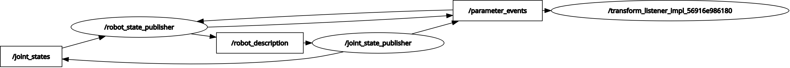
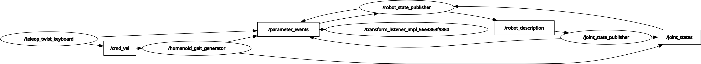

# **unitree_g1_rviz repository** -  Non Physics related simulation of the robot

Creation of the digital twin can be done using mathematical softwares, like solidworks etc. The availabilty of exisiting Meshes, URDF and XML files can be utilised for the bypass of modelling.

[Unitree_G1 Description repository from the company side](https://github.com/unitreerobotics/unitree_ros/tree/master/robots/g1_description) 

Data for the Unitree G1 
[Meshes](/humanoid_ws/src/unitree_g1_description/meshes) 
[URDF_and_XML](/humanoid_ws/src/unitree_g1_description/urdf_xml) 

## URDF rendering check 

*ros2 run robot_state_publisher robot_state_publisher --ros-args -p robot_description:="$(cat < full path to the urdf file >)"*

*ros2 run joint_state_publisher_gui joint_state_publisher_gui*

*ros2 run rviz2 rviz2*

*OR*  
Running the launch file which encapsulated all the above mentioned individual terminal commands

*ros2 launch unitree_g1_rviz display.launch.py*

Topic list - 

/clicked_point 
/goal_pose 
/initialpose 
/joint_states 
/parameter_events 
/robot_description 
/rosout 
/tf 
/tf_static 

  

## Robot Locomotion with Keyboard Joystick Node

The robot locomotion involves with its root link moves relative to a global fixed frame like odom or graph, making the robot glide or float on command over the /cmd_vel topic with the virtual odometry node (walker.py) with the following functionality: 

a. Listen for velocity commands (/cmd_vel) 
b. Calculate the new position 
c. Broadcast a TF Transform from odom -> pelvis 

*ros2 run unitree_g1_rviz walker.py*  

The keyboard control node  

*ros2 run teleop_twist_keyboard teleop_twist_keyboard* 

The viewing TF tree -  

*ros2 run tf2_tools view_frames* 

-> Smoother locomotion can be acheived by a modified version of the virtual odometry node (humanoid_gait_generator.py) in which the ghost mode is alterated to match human gait with the help of inverse kinematics and transforms 

*ros2 run unitree_g1_rviz humanoid_gait_generator.py* 

  

